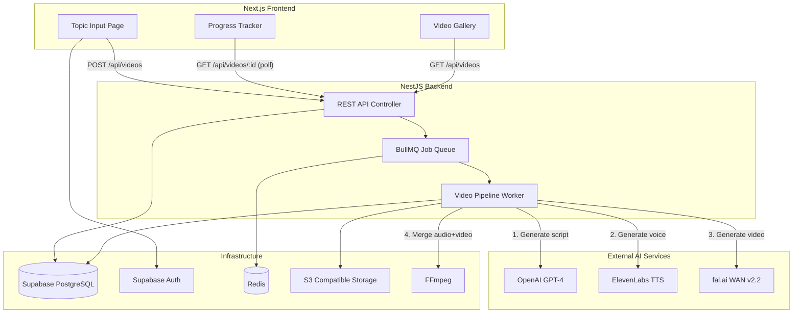
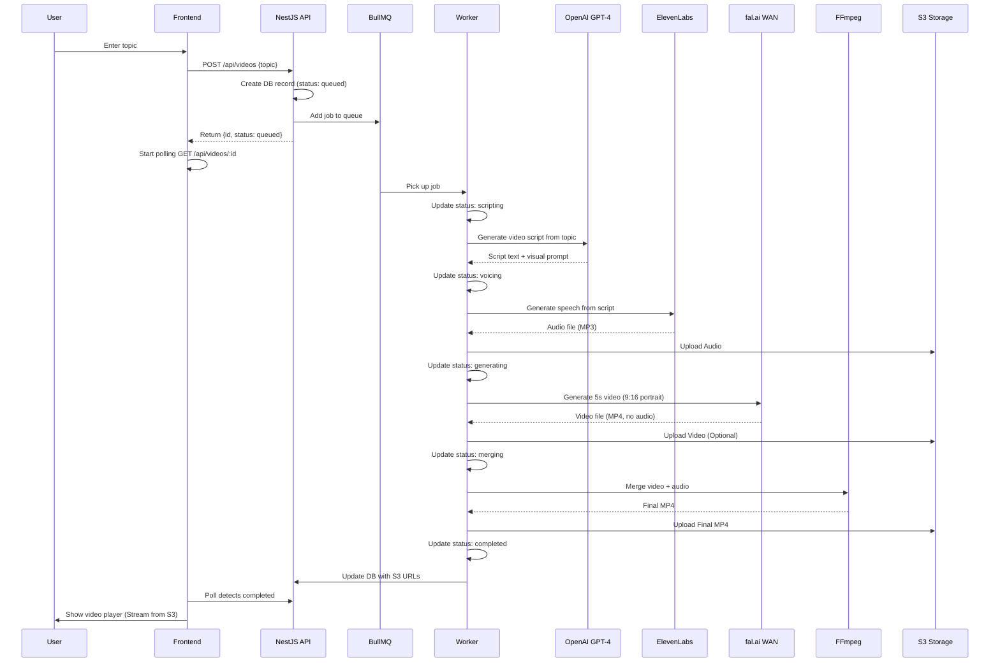

# AI Short-Form Video Generator — Implementation Plan

## Table of Contents

- [Overview](#overview)
- [Architecture](#architecture)
- [Video Generation Pipeline](#video-generation-pipeline)
- [Project Structure](#project-structure)
- [Database Schema](#database-schema)
- [Next Phase: Phase 1 — Cloud Storage (S3 / Cloudflare R2 / MinIO)](#next-phase-phase-1--cloud-storage-s3--cloudflare-r2--minio)
- [Future Phases](#future-phases)
  - [Phase 2 — Supabase Migration (Auth + DB)](#phase-2--supabase-migration-auth--db)
  - [Phase 3 — Auto-Publishing to Social Platforms](#phase-3--auto-publishing-to-social-platforms)
  - [Phase 4 — Multi-Scene Videos](#phase-4--multi-scene-videos)
  - [Phase 5 — Credits and Billing](#phase-5--credits-and-billing)
  - [Phase 6 — Dashboard and Analytics](#phase-6--dashboard-and-analytics)

---

## Overview

A SaaS platform that generates short-form video content (YouTube Shorts, TikTok, Instagram Reels) entirely with AI. The user provides a topic, and the platform:

1. Generates a voiceover script and visual description using **OpenAI GPT-4**
2. Converts the script to speech using **ElevenLabs TTS**
3. Generates a 5-second video using **fal.ai WAN v2.2-5b**
4. Merges video and audio into a final MP4 using **FFmpeg**

The output is a vertical (9:16) short-form video ready for upload to any platform.

---

## Architecture



**Stack Summary:**

| Layer     | Technology                                      |
| --------- | ----------------------------------------------- |
| Frontend  | Next.js (App Router) + Tailwind CSS + shadcn/ui |
| Backend   | NestJS + TypeScript                             |
| Database  | Supabase (PostgreSQL) + Prisma ORM              |
| Auth      | Supabase Auth                                   |
| Queue     | BullMQ + Redis                                  |
| Storage   | S3 Compatible (AWS S3 / R2 / MinIO)             |
| AI Script | OpenAI GPT-4                                    |
| AI Voice  | ElevenLabs Text-to-Speech                       |
| AI Video  | fal.ai WAN v2.2-5b (fast-wan)                   |
| Merging   | FFmpeg (via fluent-ffmpeg)                      |

---

## Video Generation Pipeline



---

## Project Structure

```
some-saas/
├── backend/                        # NestJS application
│   ├── src/
│   │   ├── app.module.ts
│   │   ├── main.ts
│   │   ├── config/
│   │   │   └── configuration.ts    # Environment config
│   │   ├── video/
│   │   │   ├── video.module.ts
│   │   │   ├── video.controller.ts # REST endpoints
│   │   │   ├── video.service.ts    # Business logic
│   │   │   ├── video.processor.ts  # BullMQ worker/processor
│   │   │   └── dto/
│   │   │       ├── create-video.dto.ts
│   │   │       └── video-response.dto.ts
│   │   ├── ai/
│   │   │   ├── ai.module.ts
│   │   │   ├── script.service.ts   # OpenAI GPT-4 integration
│   │   │   ├── voice.service.ts    # ElevenLabs integration
│   │   │   └── video-gen.service.ts# fal.ai integration
│   │   └── media/
│   │       ├── media.module.ts
│   │       └── media.service.ts    # FFmpeg merging + S3 Uploads (Pending)
│   ├── prisma/
│   │   └── schema.prisma           # Database schema (Supabase)
│   ├── uploads/                    # Temporary local generation folder
│   ├── .env                        # API keys + DB URL
│   ├── package.json
│   └── tsconfig.json
│
├── frontend/                       # Next.js application
│   ├── src/
│   │   ├── app/
│   │   │   ├── layout.tsx
│   │   │   ├── page.tsx            # Landing + topic input
│   │   │   ├── generate/
│   │   │   │   └── [id]/
│   │   │   │       └── page.tsx    # Progress + result page
│   │   │   └── videos/
│   │   │       └── page.tsx        # Video gallery
│   │   ├── components/
│   │   │   ├── topic-form.tsx
│   │   │   ├── progress-tracker.tsx
│   │   │   ├── video-card.tsx
│   │   │   └── video-player.tsx
│   │   └── lib/
│   │       ├── api.ts              # Backend API client
│   │       └── supabase.ts         # Supabase client mapping (Pending)
│   ├── .env.local
│   ├── package.json
│   └── tailwind.config.ts
│
├── docs/
│   └── implementation-plan.md      # This document
│
└── README.md
```

---

## Database Schema

Prisma schema mapped to Supabase PostgreSQL:

```prisma
generator client {
  provider = "prisma-client-js"
}

datasource db {
  provider = "postgresql"
  url      = env("DATABASE_URL")
  directUrl = env("DIRECT_URL") // Required for Supabase + Prisma migrations
}

model Video {
  id          String   @id @default(cuid())
  userId      String?  // References Supabase Auth UID (Pending Phase 2)
  topic       String
  status      String   @default("queued")
  script      String?  @db.Text
  visualPrompt String? @db.Text
  audioUrl    String?  // Will update to S3 URL
  videoUrl    String?  // Will update to S3 URL
  finalUrl    String?  // Will update to S3 URL
  error       String?  @db.Text
  createdAt   DateTime @default(now())
  updatedAt   DateTime @updatedAt
}
```

---

## Next Phase: Phase 1 — Cloud Storage (S3 / Cloudflare R2 / MinIO)

**Goal:** Stop saving user-generated media permanently on the local server disk.

1. **Backend Integration:**
   - Install AWS SDK (`@aws-sdk/client-s3`).
   - Create an `StorageService` inside `MediaModule` or a new `StorageModule`.
   - Update `VideoProcessor` / `MediaService` to upload the generated `audio.mp3`, `video.mp4`, and `final.mp4` to the S3 bucket.
   - Return the public (or pre-signed, if private) S3 URLs and store them in the `audioUrl`, `videoUrl`, and `finalUrl` fields in the `Video` table.
   - Implement cleanup logic to delete the temporary local files from `uploads/` after a successful S3 upload.
2. **Frontend Integration:**
   - Update the UI player to stream directly from the S3 URLs instead of `/api/videos/:id/download` proxy, reducing load on the NestJS server.

---

## Future Phases

### Phase 2 — Supabase Migration (Auth + DB)

**Goal:** Move database hosting to Supabase and integrate Supabase Auth for user accounts.

- Migrate existing local PostgreSQL database (via Prisma) to a Supabase project.
- Integrate `@supabase/supabase-js` and `@supabase/ssr` in the Next.js frontend.
- Protect frontend routes with middleware.
- Add Login / Sign-up pages.
- Add a `userId` column to the `Video` model linking to Supabase's `auth.users` table.
- Update the NestJS backend to validate Supabase JWTs attached to requests (using `@nestjs/passport` and `passport-jwt` with the Supabase JWT secret).
- Fetch and display the authenticated user's private video gallery.

### Phase 3 — Auto-Publishing to Social Platforms

**Goal:** Cron jobs that automatically publish generated videos to social media.

- OAuth integration with:
  - **YouTube Data API v3** — upload as YouTube Shorts
  - **TikTok Content Posting API** — upload as TikTok videos
  - **Instagram Graph API** — upload as Instagram Reels
- New database models:
  - `SocialAccount` — stores OAuth tokens per user per platform
  - `PublishJob` — tracks publishing status per video per platform
- Settings page for connecting social accounts
- Cron scheduler (e.g., `@nestjs/schedule`) to:
  - Automatically publish completed videos on a schedule
  - Retry failed publishes
  - Refresh expired OAuth tokens

### Phase 4 — Multi-Scene Videos

**Goal:** Support longer videos with multiple scenes, transitions, and background music.

- GPT-4 generates a multi-scene script (array of scenes, each with voiceover + visual prompt)
- Each scene generates its own 5-second video clip via fal.ai
- ElevenLabs generates full narration audio for all scenes
- FFmpeg concatenates scenes with transitions (crossfade, cut)
- Optional background music layer (royalty-free library or AI-generated)
- Configurable video length: 15s, 30s, 60s
- Scene-by-scene progress tracking in the UI

### Phase 5 — Credits and Billing

**Goal:** Monetize the platform with a credit-based system.

- Each video generation costs credits (based on length and quality)
- **Stripe** integration for purchasing credit packs and subscriptions
- Subscription tiers:
  - **Free** — 3 videos/month
  - **Pro** — 50 videos/month + priority queue
  - **Business** — unlimited + auto-publishing + API access
- New database models:
  - `Subscription` — Stripe subscription data
  - `CreditTransaction` — credit purchase and usage ledger
- Usage tracking and quota enforcement middleware
- Billing page in the frontend with usage stats

### Phase 6 — Dashboard and Analytics

**Goal:** Provide users with insights into their content performance.

- Dashboard page showing:
  - Total videos generated
  - Videos published per platform
  - Generation success/failure rates
  - Credit usage over time
- Per-video analytics (when auto-publishing is active):
  - View counts from YouTube/TikTok/Instagram APIs
  - Engagement metrics (likes, comments, shares)
  - Best-performing topics and time slots
- Charts and graphs using a library like Recharts or Chart.js
- Export analytics data as CSV
- Weekly email summary of performance (optional)
